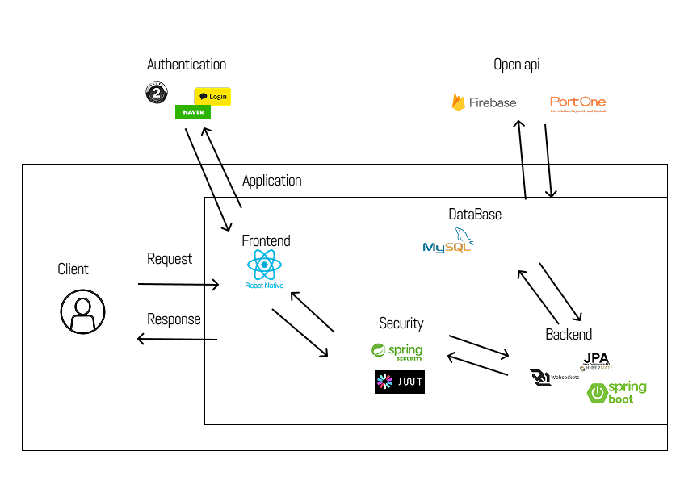

  
# 🧑‍🤝‍🧑 무료한 일상을 다채롭게 채워줄 앱 모아모아 🎨

모아모아는 매일 반복되는 무료한 일상에 활력을 불어넣는 <b>소모임 서비스</b>입니다. 
다양한 소모임을 생성하고 참여하며, 서로의 성장을 응원하고 공유하는 커뮤니티 공간을 제공합니다.

 

## 👨‍👩‍👧‍👦 팀원 소개

| 곽나영 | 박채연 | 이다솔 | 이영헌 | 조수지 | 한상진 |
| :---: | :---: | :---: | :---: | :---: | :---: |
| 백엔드 | 백엔드 | 백엔드 | 디자인, 프론트엔드 | 디자인, 프론트엔드 | 백엔드 |
| [@skdudnayoung](https://github.com/skdudnayoung) | [@pcochoco](https://github.com/pcochoco) | [@LeeDyol](https://github.com/LeeDyol) | [@Yhyun31](https://github.com/Yhyun31) | [@syuzzzi](https://github.com/syuzzzi) | [@Sjin618](https://github.com/Sjin618) |

 

## 👩🏻‍💻 사용 기술 구성도

 

## 🚀 실행 방법

### 프론트엔드
    레포 클론
    npm install
    npx prebuild
    npx expo run:android
    npx expo run:ios

### 백엔드
    레포 클론
    IntelliJ IDEA - bootRun(서버 열기)

 

## ✨ 커밋 규칙

| 규칙 | 설명 |
| :--- | :--- |
| ✨`feat` | 새로운 기능 추가 |
| 🐞`bugfix` | 버그 수정 |
| ♻️`refactor` | 코드 리팩토링 |
| 🎨`style` | 코드 포맷팅, 스타일 변경 |
| 📃`docs` | 문서 수정 및 추가 |

 

